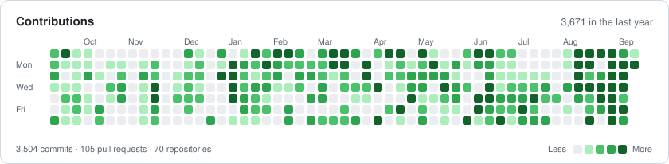
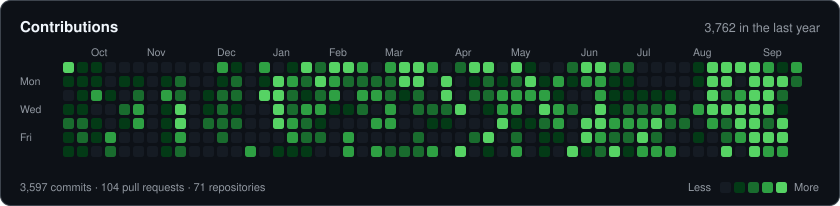
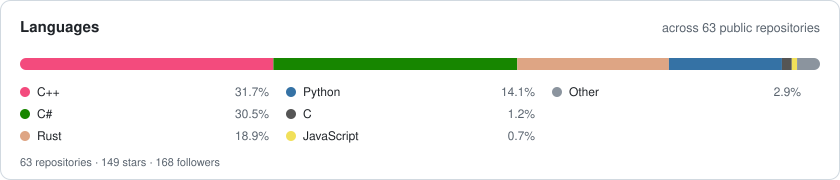
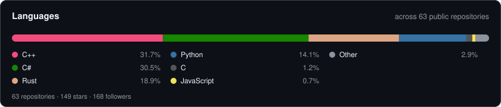

# Petras Vestartas

**Computational design · Timber joinery · Geometry kernels · Robotics · Computer vision**

PhD in Timber Structures, [IBOIS](https://www.epfl.ch/labs/ibois/) · EPFL &nbsp;&nbsp;|&nbsp;&nbsp; Postdoctoral researcher, [Block Research Group](https://block.arch.ethz.ch) · ETH Zürich

I build open-source geometry tooling for digital fabrication.

---

## Own work

- **[wood_research](https://github.com/petrasvestartas/wood_research)** &nbsp;  — Timber joinery stack — solver, bindings, COMPAS wrapper. &nbsp;[📖](https://petrasvestartas.github.io/compas_wood/latest/)
- **[OpenNest](https://github.com/petrasvestartas/OpenNest)** &nbsp;  — 2D nesting for Rhino / Grasshopper. &nbsp;[📖](https://petrasvestartas.github.io/OpenNest/)
- **[NGon](https://github.com/petrasvestartas/NGon)** &nbsp; — N-gon mesh processing for Grasshopper. &nbsp;[📦](https://www.food4rhino.com/en/app/ngon)
- **[session](https://github.com/petrasvestartas/session)** &nbsp;   — One geometry kernel, three languages, one test suite.

---

## Team work

**[COMPAS](https://compas.dev)** — computational framework for architecture, engineering and fabrication

- **[compas_cgal](https://github.com/compas-dev/compas_cgal)** &nbsp;  — CGAL bindings.
- **[compas_libigl](https://github.com/compas-dev/compas_libigl)** &nbsp;  — libigl bindings.
- **[compas_occt](https://github.com/petrasvestartas/compas_occt)** &nbsp;  — OpenCASCADE geometry backend. &nbsp;[📖](https://petrasvestartas.github.io/compas_occt) &nbsp;[📦](https://pypi.org/project/compas-occt/)
- **[compas_shapeop](https://github.com/compas-dev/compas_shapeop)** &nbsp;  — ShapeOp bindings.
- **[compas_nanobind_package_template](https://github.com/compas-dev/compas_nanobind_package_template)** &nbsp;  — Template for C++ extensions.
- **[compas](https://github.com/compas-dev/compas)** &nbsp; — The main COMPAS library.

**[Block Research Group](https://block.arch.ethz.ch), ETH Zürich**

- **[compas_model](https://github.com/BlockResearchGroup/compas_model)** &nbsp; — Model datastructure for design, analysis and fabrication.
- **[compas-RV](https://github.com/BlockResearchGroup/compas-RV)** &nbsp; — Form finding with reciprocal diagrams.
- **[compas_cra](https://github.com/BlockResearchGroup/compas_cra)** &nbsp; — Coupled Rigid-Block Analysis.
- **[compas_lmgc90](https://github.com/BlockResearchGroup/compas_lmgc90)** &nbsp;  — LMGC90 contact solver wrapper.
- **[compas_3dec](https://github.com/BlockResearchGroup/compas_3dec)** &nbsp; — Discrete element modelling with Itasca 3DEC.
- **[compas_grid](https://github.com/BRG-research/compas_grid)** &nbsp; — Grid structures for multi-storey buildings.
- **[compas_cnc](https://github.com/BRG-research/compas_cnc)** &nbsp; — Subtractive fabrication operations.

**[IBOIS](https://www.epfl.ch/labs/ibois/), EPFL** — Laboratory for Timber Constructions

- **[Cockroach](https://github.com/ibois-epfl/Cockroach)** &nbsp; — Point cloud processing and meshing for Rhino.
- **[Raccoon-ibois](https://github.com/ibois-epfl/Raccoon-ibois)** &nbsp; — CNC toolpath generation.
- **[COMPAS_ABB6700_IRBT](https://github.com/ibois-epfl/COMPAS_ABB6700_IRBT)** &nbsp;  — ABB IRB6700 on a linear track.

---

## Toolbox

**Languages**

**Geometry &amp; fabrication**

**Build &amp; tooling**

---

---

### Support this work

The libraries above are free and maintained in the open.
If they save you time, sponsorship keeps them moving.

